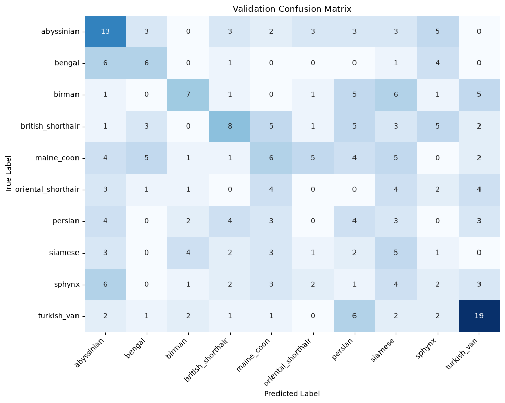
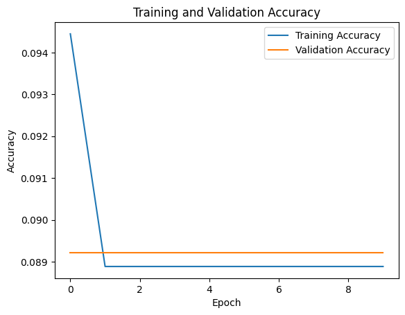
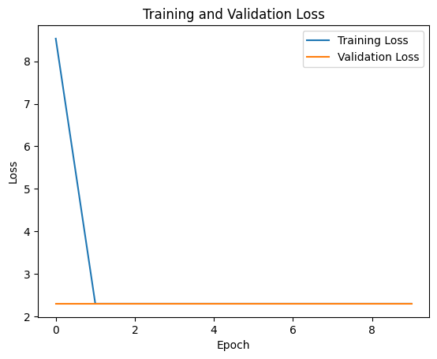

# Group Name : Jhadieja and Friends
1. Bargado, Jhadieja D.
2. Dominguez, Laurence Jhon A.
3. Doral, Zhynnel

first test overfitted

validation lost

first failed guess

Confused Confusion matrix where the model can predict turkish_van but cant identify other classes

flat line of death
 

 
 first approach Parameter Tuning
 at this block of the code we try to increase the the value from 32, 64, 128, 256 to 64, 128, 256, 512 which gives the model more capacity to memorize
 Even after letting it run for 35 epochs, the validation line (orange) completely flattens out between 0.30 and 0.35 starting around Epoch 20. Training it for 50 or 100 epochs will not make it climb higher.
 a scratch CNN alone isn't enough for this problem, which is why bringing in a pre-trained model like mobilenetv2 makes way more sense.